## Getting Started with Alexa-Hosted Skill to Build an Alexa Skill

## Overview

Alexa is the voice service that powers Echo device, or skills, that enable customers to interact
with devices in a more intuitive way using voice.
Alexa is built in the cloud, so it is always getting
smarter.

Under the trend of AIoT, Alexa is no longer just a smart speaker, and is gradually compatible with various hardware devices, such as: cars, refrigerators, etc, Which has prompted a large number of developers to devote the development of Alexa skill.

## Scenario

In this lab we will create a [Minecraft](https://www.minecraft.net/zh-hant/) helper skill for Alexa, this skill can let user to ask Alexa how to get the materials and build your tools in Minecraft without interrupt your game experience.

## Prerequisite

- Register for an [__Amazon Account__](https://www.amazon.com/ap/register?_encoding=UTF8&openid.assoc_handle=usflex&openid.claimed_id=http%3A%2F%2Fspecs.openid.net%2Fauth%2F2.0%2Fidentifier_select&openid.identity=http%3A%2F%2Fspecs.openid.net%2Fauth%2F2.0%2Fidentifier_select&openid.mode=checkid_setup&openid.ns=http%3A%2F%2Fspecs.openid.net%2Fauth%2F2.0&openid.ns.pape=http%3A%2F%2Fspecs.openid.net%2Fextensions%2Fpape%2F1.0&openid.pape.max_auth_age=0&openid.return_to=https%3A%2F%2Fwww.amazon.com) ***(not AWS account)**

## Lab tutorial

### Sign up Amazon Developer Account with Amazon Account

If you already have an __Amazon Developer Account__, please skip this step.

- Get into [Amazon Developer Account](https://developer.amazon.com/?&sc_category=Owned&sc_channel=RD&sc_campaign=Evangelism2018&sc_publisher=github&sc_content=Content&sc_detail=howto-nodejs-V2_CLI-1&sc_funnel=Convert&sc_country=WW&sc_medium=Owned_RD_Evangelism2018_github_Content_howto-nodejs-V2_CLI-1_Convert_WW_beginnersdevs&sc_segment=beginnersdevs) catalog page.

    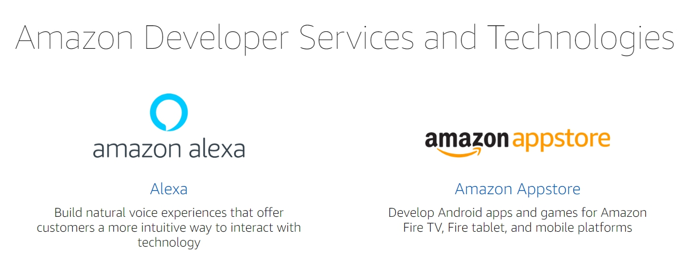

- Select __Alexa__, and you will be taken to the Amazon Alexa console.

    

- Select __Sign In__ with your __Amazon account__ on the upper right corner.

    > After sign in, you will turn back to Alexa console automatically.

- Move your mouse over the __Account Name__ on upper right corner, and select __Complete Registration__.

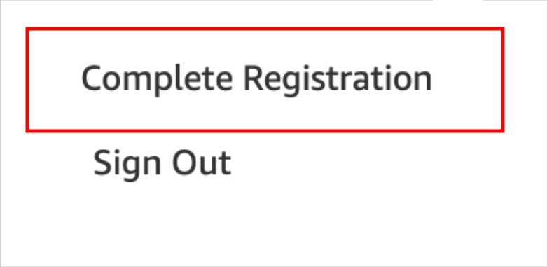

> Now we have to sign up the Amazon Developer Account step by step.

- Insure the required field has been fill in, and then select __Save and Continue__.

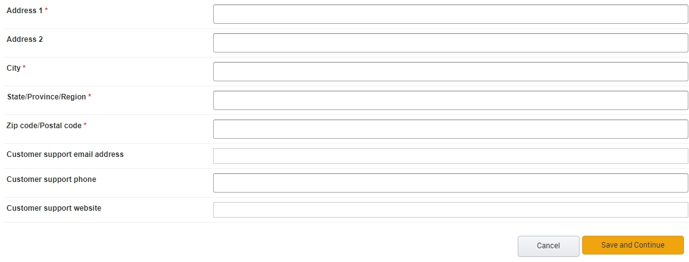

- In this step, you can just roll down and select __Accept and Continue__.

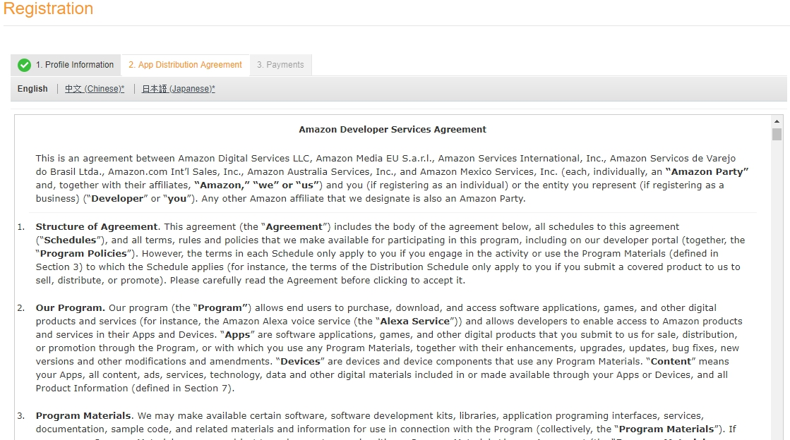

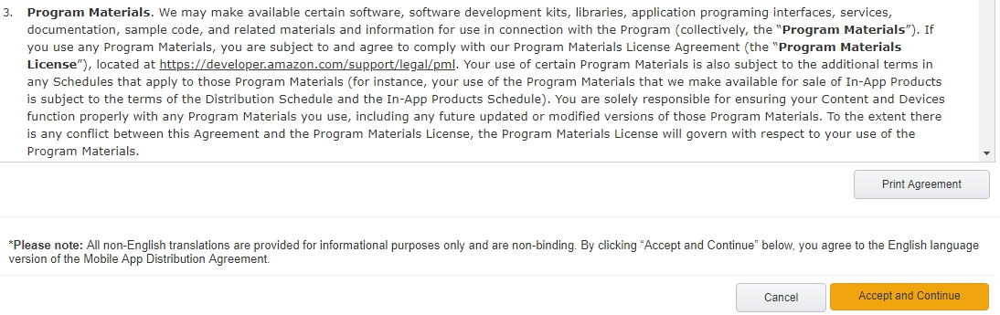

- Select __No__ for two option, and choose __Save and Continue__.

    > Select __No__ to save some time for the next steps. 

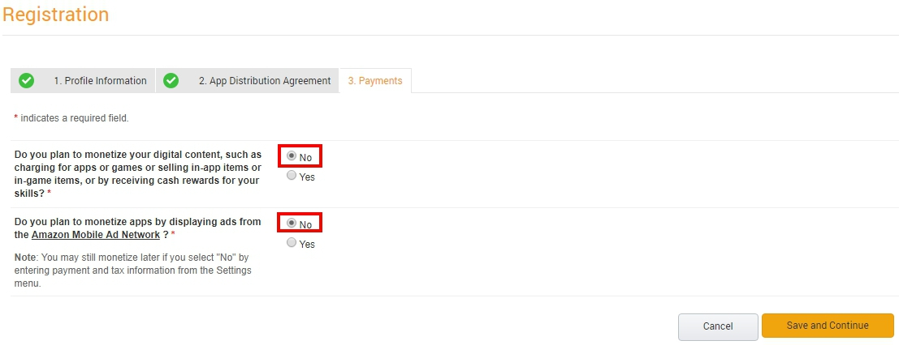

- Choose __Alexa__ on the panel, and select __Alexa Skills Kit__.

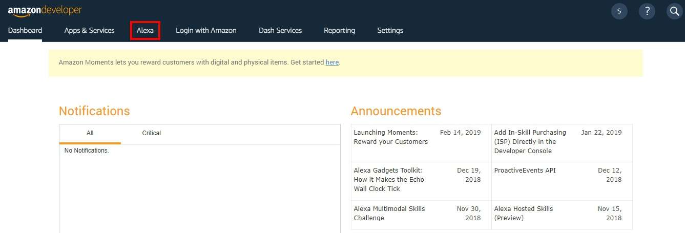

    

### Create an Custom Alexa Skill

- Select __Create Skill__ on your alexa developer console.

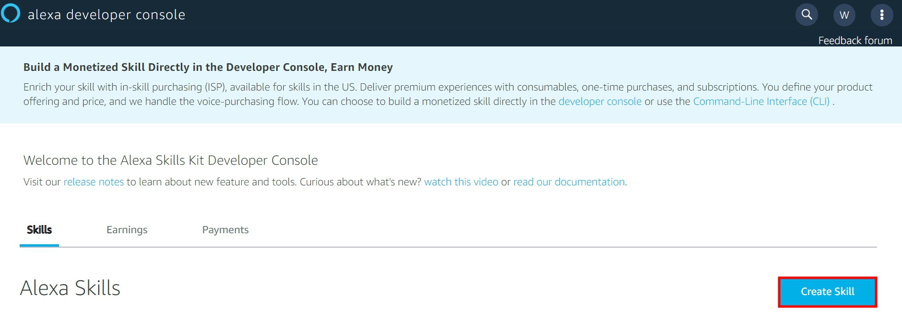

- Type `yourskillname`, and choose __English__ as default language.

    >This is the name that will be shown in the Alexa Skills Store

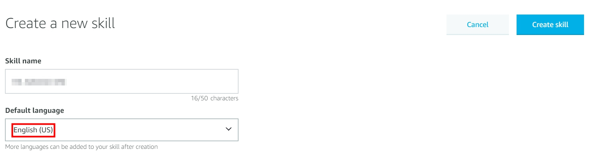

- Add a __Custom__ model to your skill. 

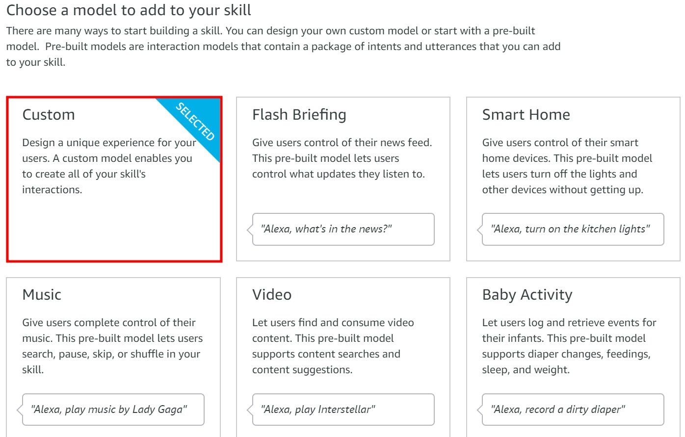

- Choose __Alexa-Hosted__, let AWS host our backend resources.

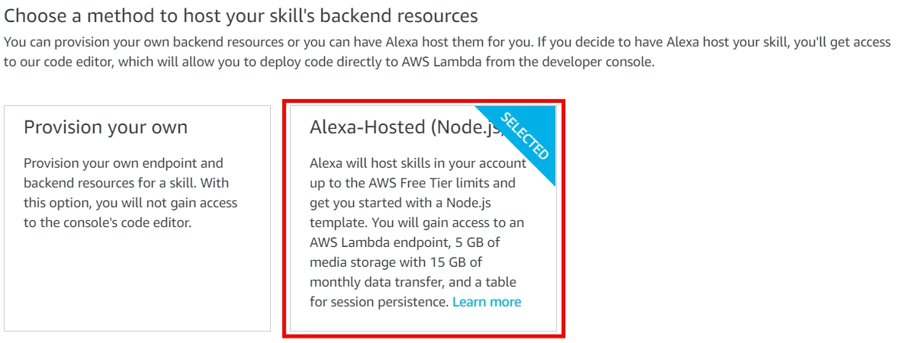

> With an Alexa-hosted skill, you can get started quickly using Alexa-hosted AWS resources to power your skill without leaving the console.

- Roll up the page, and select __Create skill__.

    > It will take one to three minutes to create environment.

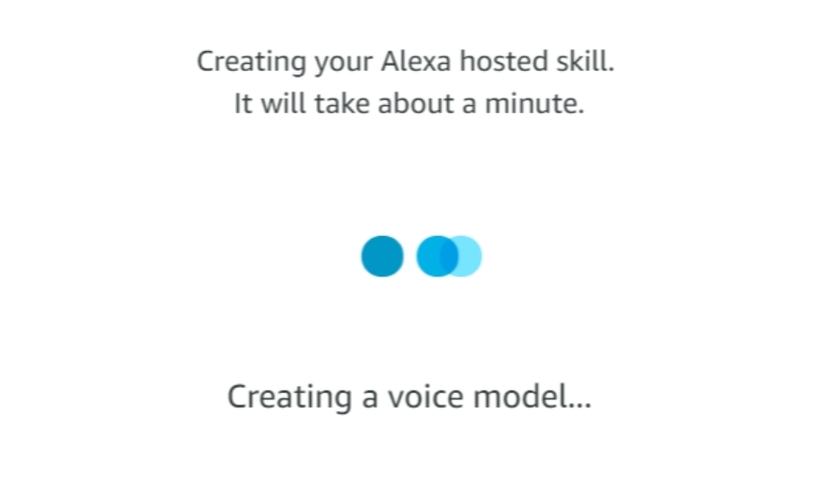

- Select __Invocation__ on left side.

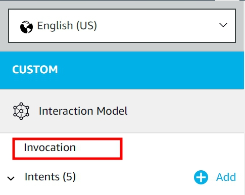

- change __Skill Invocation Name__ to `minecraft helper`.

    > The __Skill Invocation Name__ is the key words that awake Alexa to use this skill.

    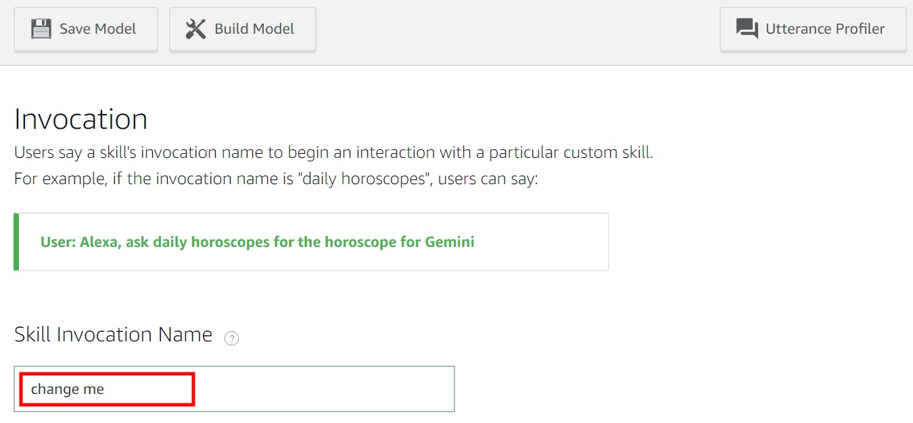

- Select __Save Model__ and then __Build Model__ on the top of this field.

    > You will see a message after __Build Model__.

    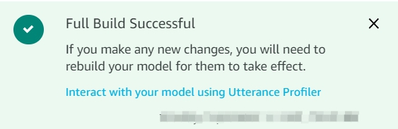

- Select __JSON Editor__ on your left side.

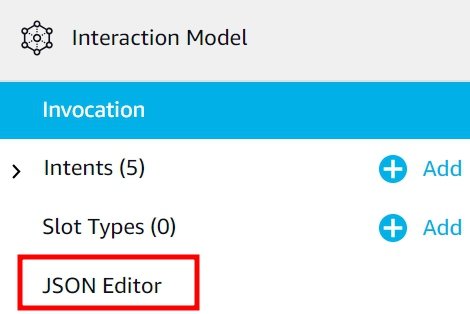

- Download the [__module__](../Tutorial-01-Use-Alexa-Hosted-Skill-to-Build-a-Custom-Skill/module/VUI_JSON.json), and upload the __VUI_JSON.json__ file.

    > Don't forget to __Save Model__ and __Build Model__ again.
    

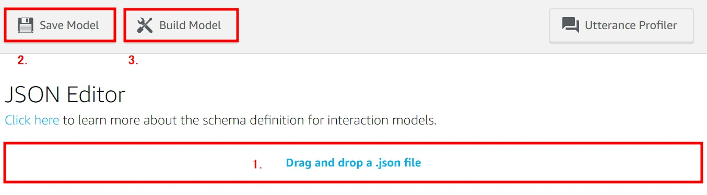

> You should notice that __Intents__ and __Slot Types__ will auto populate based on the JSON Interaction Model that you have now applied to your skill. 
   

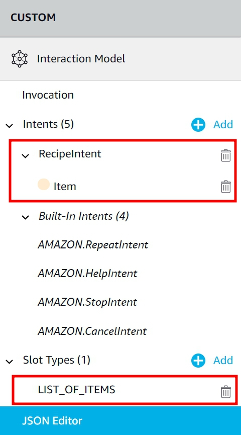

> You can also select an intent by expanding the Intents from the left side navigation panel.

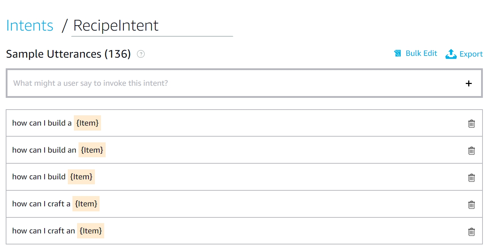

> Add some more sample utterances for your newly generated intents __optionally__, but be sure to click __Save Model__ and __Build Model__ after you're done making changes here.

### Deploy the Code by Alexa-Hosted Code Editor

- Select __Code__ on upper panel.

- If you the message on upside, select __Use Alexa hosted endpoint__.

 

- You will see a console just like __AWS Lambda__.

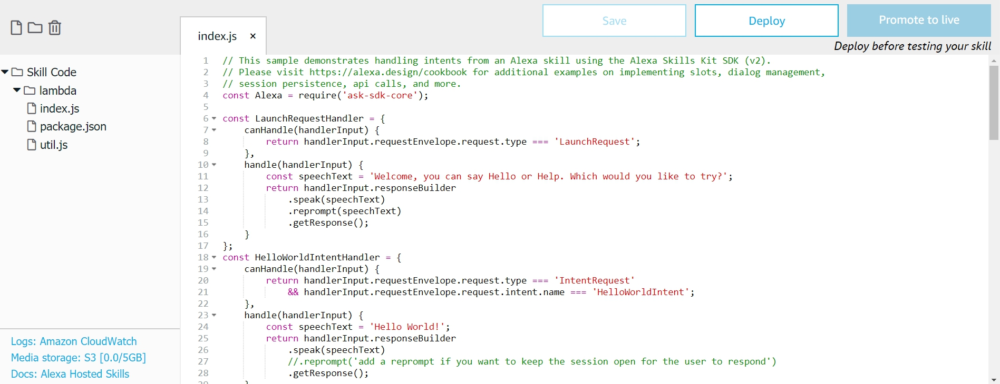

- Clean up all the original __index.js__, and copypaste the [__Index.js__](../Tutorial-01-Use-Alexa-Hosted-Skill-to-Build-a-Custom-Skill/lambda/index.js). Then, click __Save__.

- Double click the __package.json__ on left side, clean up the original content and paste the [__package.json__](../Tutorial-01-Use-Alexa-Hosted-Skill-to-Build-a-Custom-Skill/lambda/package.json) as previous step. Then, click __Save__.

- Select the __Icon__ as following to add a new file.

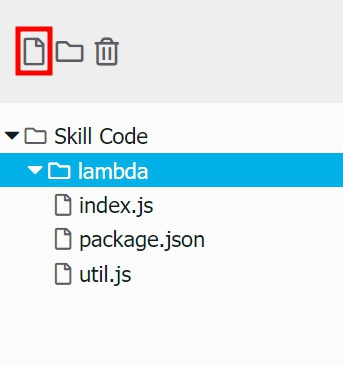

- Type `lambda/recipes.js` as __File Path__, and __Create File__.

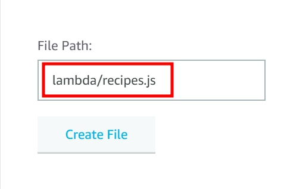

- Copy the [__recipes.js__](../Tutorial-01-Use-Alexa-Hosted-Skill-to-Build-a-Custom-Skill/lambda/recipes.js), and paste in the __recipes.js__ file what you created.

- Select __Save__ and then __Deploy__.

    > Wait for two minutes, you will see the message

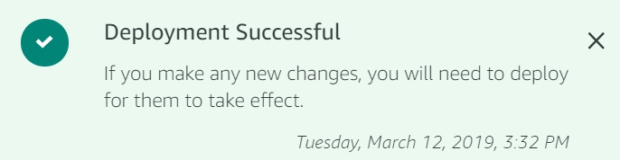

> This will deploy your code into a Lambda function that is automatically managed for you by the Alexa-Hosted service.

### Testing Your Alexa Skill with Alexa Simulator

- Select __test__ on upper panel.

- Extend the list, and choose __Development__.

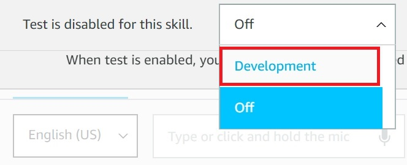

- Type or say `Alexa, open the minecraft helper`.

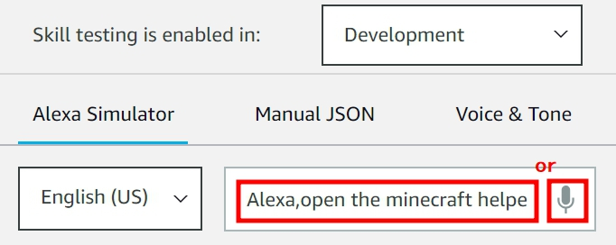

> You will receive the response from Alexa Simulator

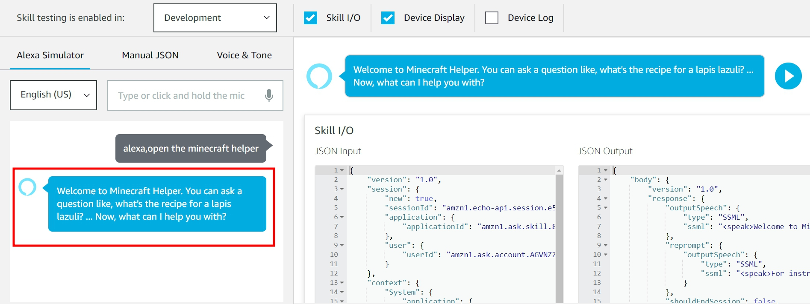

- Now, you can ask everything can be created in Minecraft world, try to type `how can I get a sugar cane`.

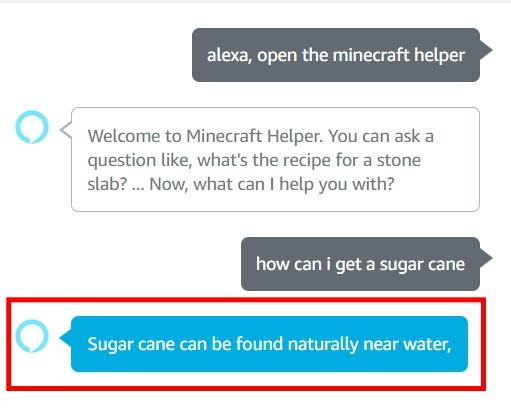

> NOTES : If you are idle for too long, you need to wake up "Minecraft skill" again by saying or typing "Alexa, open the minecraft helper".

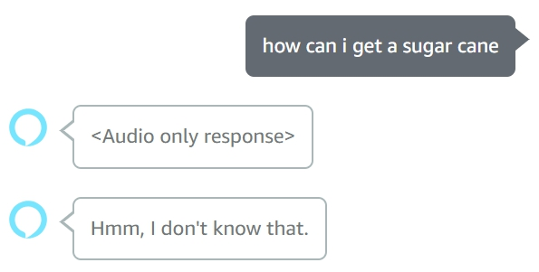

- Alexa will remember your pronunciation, and understand what you mean. 

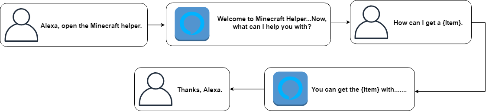

## Conclusion

Amazon Alexa is a big step forward when it comes to voice control
technology. It's always on microphones and integration with third-party apps means that there really are a ton of things that you can do using just your voice.
Now, you can build your custom skills if you like! 

## Reference

- [Alexa-Hosted Skill](https://developer.amazon.com/docs/hosted-skills/build-a-skill-end-to-end-using-an-alexa-hosted-skill.html)